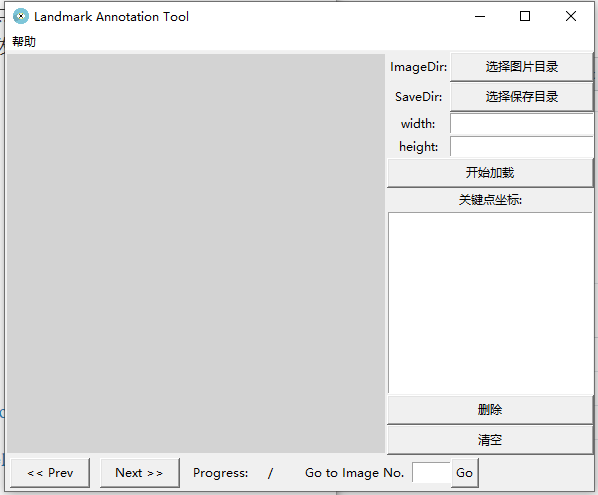
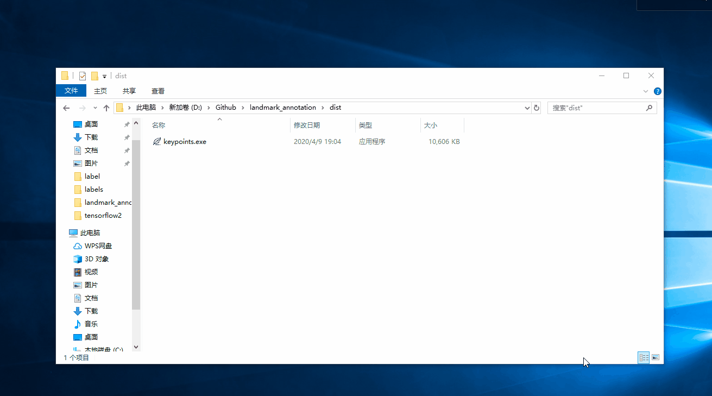

# landmark_annotation
关键点标注软件，因为周边的好多人在做关键点识别，但是苦于没有类似LabelImg、Labelme这样的软件，所以受[BBox-Label-Tool]( https://github.com/puzzledqs/BBox-Label-Tool )的启发，打算用tkinter重新开发一个关键点标注工具。

**新特性**

重新构建了界面，更加人性化




**使用说明**



视频教程：bilibili

快捷键：

a: 上一张图片

d: 下一张图片

s: 保存当前图片

保存格式：

```
关键点个数
每行一个关键点坐标，归一化到0-1
```

**版本**

v1.0 keypoints.exe 请在release中下载。

 https://github.com/pprp/landmark_annotation/releases 

**同类工具**

目标框： https://github.com/puzzledqs/BBox-Label-Tool 

先目标框再关键点： https://github.com/Jeff-sjtu/labelKeypoint 

**例子**

基于这个标注软件的结果，写了一个关键点识别的demo：

 https://github.com/pprp/SimpleCVReproduction/tree/master/simple_keypoint 

需要说明的是，这是个非常简单的demo, 每张图只有一个关键点，所以只需要回归出一个坐标即可。

**吐槽**

tkinter网上介绍真的不多，摸索了好长时间。

tkinter相比pyqt更简单，但是界面布局真的一言难尽。

此软件使用grid方式构建，界面上要比QT不那么灵活。